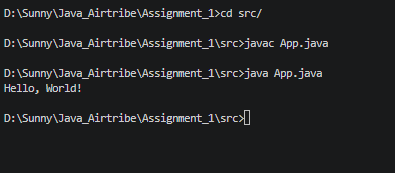

# Java Environment & Hello World Program

---

## Java Version Details

```bash
java 17.0.12 2024-07-16 LTS
Java(TM) SE Runtime Environment (build 17.0.12+8-LTS-286)
Java HotSpot(TM) 64-Bit Server VM (build 17.0.12+8-LTS-286, mixed mode, sharing)


>>Screenshots or brief explanation of “Hello World” program run.

- A basic Java program to print Hello World was created in App.java file
- The code was further compiled using the javac <filename>.java command
- After the .class file was generated the code was executed using the java <filename> command.
- The output of the program was displayed as : Hello, World! 

The screenshot of the terminal is attached below:

